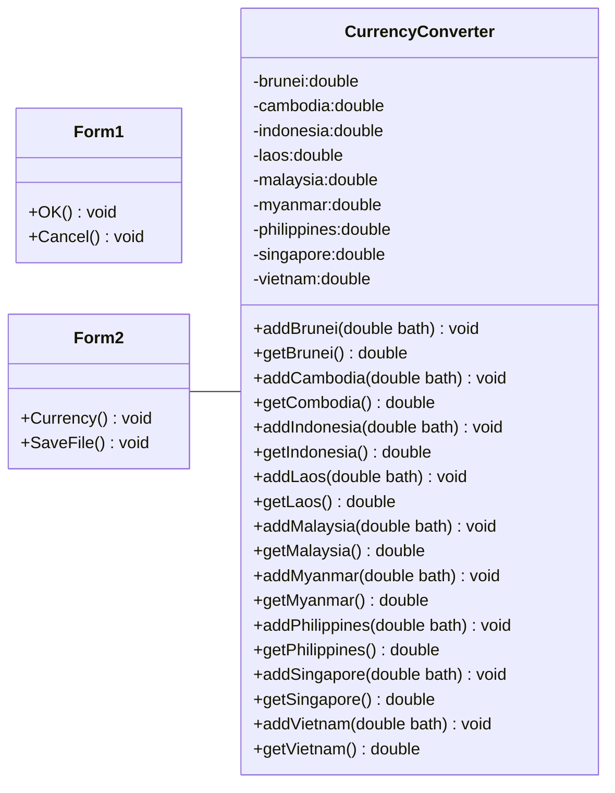

# Test-Project
ความเป็นมาของโปรแกรม
```
โปรแกรมที่สร้างขึ้นนี้เป็นโปรแกรมแปลงค่าสกุลเงินของ10ประเทศในอาเซียน สร้างขึ้นมาเพื่อแก้ปัญหาสำหรับคนที่ต้องการรู้ค่าของสกุลเงินแต่ละประเทศที่ใช้เงินไทยแลกเปลี่ยนมา 
ช่วยตอบปัญหาก่อนไปเที่ยวต่างประเทศของเราด้วยการแลกเปลี่ยนและแปลงค่าสกุลเงิน
```
วัตถุประสงค์ของโปรแกรม
```
1.เพื่อช่วยในการแปลงค่าสกุลเงินแต่ละประเทศที่เราอยากรู้ในอาเซียน และจะได้สะดวกสะบายและรู้ค่าของสกุลเงินแต่ละประเทศด้วย
2.เพื่อที่จะได้ตอบปัญหาก่อนคิดจะไปเที่ยวในประเทศต่างๆ
```
Class Diagram

ผู้พัฒนาโปรแกรม
```
นางสาวนริศรา วงค์บุตรศรี รหัสนักศึกษา 643450328-8
```
